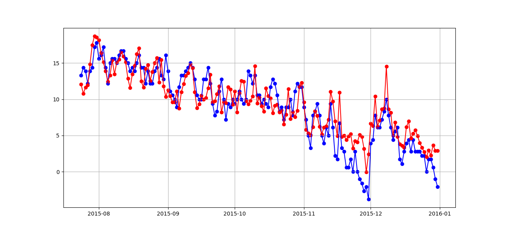

## Investigation File

### Plot for the values of the maximum temperature each day

### Lineplot for the values of the maximum temperature for every year

### Scatterplot for the values of the precipitation for every year

### Scatterplot for the values of the wind speed for every year

### Countplot for the Weather Types

### Piechart for the Weather Types

## Linear Regressions
### Linear Regression for a random split of the train and test values
    -> Calculated for the maximum temperature by date
        - Mean Squared Error : 10.995749191074138
        - R2 score :  0.7885720668665486

### Linear Regression for a default split of the train and test values (80-20)
    -> Calculated for the maximum temperature by date
        - Mean Squared Error = 11.297832171916653
        - R2 score :  0.7936850590036174

### Linear SVR for a default split of the train and test values (80-20)
    -> Calculated for the minimum temperature by date
        - Mean Squared Error :  5.427936303952954
        - R2 score :  0.7927002682556106
